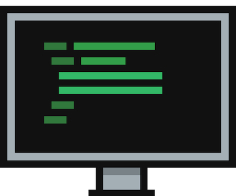

<p align="center">
    
</p>

# 🚀 Rania Guesmi - React Portfolio

A modern, responsive portfolio built with **React** and **Bootstrap 5**, showcasing my experience as a **Web Developer (Backend & Frontend)**.


## ✨ Key Features

- Fully responsive design (mobile & desktop)
- Clean and modern UI
- Multi-language support (EN / FR / ES)
- Dark & Light theme support
- Showcases experience, education, and projects
- Built with **React + Vite**
- Contact form powered by **formspree**

---

## 🌐 Live Preview

👉 Coming soon (after deployment)

---

## 📂 Project Setup

1. Clone the repository:
```bash
git clone https://github.com/YOUR-USERNAME/YOUR-REPO.git
